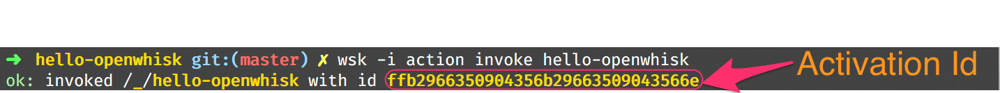
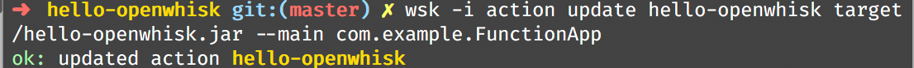
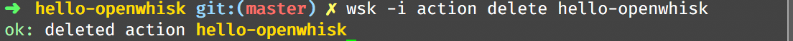

= Java Function as a Service(FaaS) Tutorial
// Settings:
:idprefix:
:idseparator: -
ifndef::env-github[]
:icons: font
endif::[]
ifdef::env-github,env-browser[]
:toc: preamble
:toclevels: 5
endif::[]
ifdef::env-github[]
:status:
:outfilesuffix: .adoc
:!toc-title:
:caution-caption: :fire:
:important-caption: :exclamation:
:note-caption: :paperclip:
:tip-caption: :bulb:
:warning-caption: :warning:
endif::[]

(C) 2018 https://developers.redhat.com[Red Hat Developer Experience Team]

//settings
:conum-guard-sh: #
ifndef::icons[:conum-guard-sh: # #]

= Overview

This tutorial walks you through on how to build a Java functions on a Function as a Service(FaaS) platform
 https://openwhisk.apache.org/[Apache OpenWhisk].

== Prerequisites

You will need in this tutorial

=== Tools
* https://github.com/minishift/minishift/releases[minishift]
* https://www.docker.com/docker-mac[docker]
* https://kubernetes.io/docs/tasks/tools/install-kubectl/#install-kubectl-binary-via-curl[kubectl]
* oc (eval $(minishift oc-env))
* https://maven.apache.org[Apache Maven]
* stern (brew install stern)
* https://github.com/apache/incubator-openwhisk-cli/releases/[OpenWhisk CLI]
* curl, gunzip, tar are built-in to MacOS or part of your bash shell
* git (everybody needs the git CLI)
* Java 8

=== Setup minishift
Assumes minishift, tested with minishift v1.13.1+75352e5

==== Minishift Profile Setup

[source,sh,subs=attributes+]
----

#!/bin/bash

# add the location of minishift executable to PATH

export MINISHIFT_HOME=~/minishift_1.13.1
export PATH=$MINISHIFT_HOME:$PATH

minishift profile set faas-tutorial
minishift config set memory 8GB
minishift config set cpus 3
minishift config set image-caching true
minishift addon enable admin-user
minishift addon enable anyuid {conum-guard-sh} <1>

minishift start

minishift ssh -- sudo ip link set docker0 promisc on {conum-guard-sh} <2>
----

<1> Some images that are in Apache OpenWhisk Docker hub requires __anyuid__ SCC in OpenShift
<2> This is needed for pods to communicate with each other within the cluster (TODO: need to add more clear details here)

[IMPORTANT]
====
`minishift ssh -- sudo ip link set docker0 promisc on` command needs to be execute each and every time minishift restarted
====

=== Setup environment

[source,sh]
----
#!/bin/bash

eval $(minishift oc-env) && eval $(minishift docker-env)
oc login $(minishift ip):8443 -u admin -p admin
----

=== Setup OpenWhisk

The project https://github.com/projectodd/openwhisk-openshift[OpenWhisk on OpenShift] provides the OpenShift templates required to deploy Apache OpenWhisk.

[source,sh]
----
oc new-project faas #<1>
oc project -q #<2>
oc process -f https://git.io/openwhisk-template | oc create -f - {conum-guard-sh} <3>
oc adm policy add-role-to-user admin developer -n faas {conum-guard-sh} <4>
----

<1> Its always better to group certain class of applications, create a new OpenShift project called `faas` to deploy all OpenWhisk applications
<2> Make sure we are in right project
<3> Deploy OpenWhisk applications to `openwhisk` project
<4> (**Optional**) Add `developer` user as admin to `faas` project so as to allow you to login with developer user and access `faas` project

[NOTE]
====
You need to wait for sometime to have all the required OpenWhisk pods come up and the FaaS is ready for some load. You can watch the status 
logs -f controller-0 -n faas | grep "invoker status changed"`
====

==== Verify Deployment

Launch OpenShift console via `minishift console`, a successful deployment will look like:

image::OW_Deployed_Success_1.png[OpenWhisk Pods]
image::OW_Deployed_Success_2.png[OpenWhisk Pods] 

[[configure-wsk]]
==== Configure WSK CLI

Download https://github.com/apache/incubator-openwhisk-cli/releases/[OpenWhisk CLI] and add it your PATH.  Verify your path using the command
`wsk --help`

The https://github.com/apache/incubator-openwhisk-cli/releases/[OpenWhisk CLI] needs to be configured to know where the OpenWhisk is located
and the authorization that could be used to invoke `wsk` commands.  Run the following command to have that setup:

[source,bash]
----
#!/bin/bash

AUTH_SECRET=$(oc get secret whisk.auth -o yaml | grep "system:" | awk '{print $2}' | base64 --decode)
wsk property set --auth $AUTH_SECRET --apihost $(oc get route/openwhisk --template="{{.spec.host}}")
----

Successful setup of WSK CLI will show output like:

image::OW_wsk_cli_setup.png[WSK CLI] 

In this case the OpenWhisk API Host is pointing to the local minishift nip.io address

To verify if wsk CLI is configured properly run `wsk -i action list`,that should list some  actions which are installed as part of the 
OpenWhisk setup.  If you see empty result then you <<install-catalog>>

[TIP]
====
The `nginx` in OpenWhisk deployment uses a self-signed certificate, to avoid certificate errors when using `wsk`, you need to add `wsk -i` to each of
your `wsk` commands. For convenience you can add an alias to your profile like `alias wsk='wsk -i $@'`
==== 

== Setup your Development environment

Clone the complete project from `https://github.com/redhat-developer-demos/faas-java-tutorial`, we will refer to this location as 
$PROJECT_HOME through out the document for convenience.

=== What is Action ?

**Actions** are stateless code snippets that run on the OpenWhisk platform. It is analogous to **Function** in Java idioms.  OpenWhisk
**Actions** are thread-safe meaning at a given point of time only one invocation happens.

Fore more details refer the official documentation https://github.com/apache/incubator-openwhisk/blob/master/docs/actions.md[here].

==== Your first Action

Lets quickly create a simple function in JavaScript to see if all working:

[code,sh]
----
mkdir -p getstarted
cd $PROJECT_HOME/getstarted
----

Create a file called `$PROJECT_HOME/getstarted/greeter.js` and add the following content to it:

[code,js]
----
function main() {
    return {payload: 'Welcome to OpenWhisk on OpenShift'};
}
----

Create an action called **greeter**:

[code,sh]
----
wsk -i action update greeter greeter.js
----

Lets invoke the action using command: 

[code,sh]
----
wsk -i action invoke greeter --result
----

The action invoke should respond with the following JSON:

[code,json]
----
{
    "payload": "Welcome to OpenWhisk on OpenShift"
}
----

=== Java Actions

==== Install Maven Archetype

Maven Archetype could be used to generate the template Java Action project, as of writing this tutorial the archetype is not maven central hence 
it need to install it locally,

[source,sh]
----
git clone https://github.com/apache/incubator-openwhisk-devtools
cd incubator-openwhisk-devtools/java-action-archetype
mvn -DskipTests clean package
----

==== Your first Java Action

Lets now create the first Java Action a simple "hello world" kind of function,  have it deployed to OpenWhisk and finally 
invoke to see the result.  This section will also details the complete Create-Update-Delete cycle of Java **Actions** on OpenWhisk.

[NOTE]
====
For easier jar names all the examples will be using maven `<finalName>`.  If you generating new project following the instructions
just be sure to update the default `<finalName>` in `pom.xml` to `${artifactId}` to make the command instructions in subsequent section 
work without any changes.
====

===== Create Java Action

[source,sh]
----
cd $PROJECT_HOME
mvn archetype:generate \
  -DarchetypeGroupId=org.apache.openwhisk.java \
  -DarchetypeArtifactId=java-action-archetype \
  -DarchetypeVersion=1.0-SNAPSHOT \
  -DgroupId=com.example \
  -DartifactId=hello-openwhisk
----

===== Build 
[code,sh]
----
cd hello-openwhisk
mvn clean package 
----

===== Deploy to OpenWhisk 

====== Create 

[source,sh]
----
wsk -i action create hello-openwhisk target/hello-openwhisk.jar --main com.example.FunctionApp
----

[[action-invocation]]
===== Invoke and Verify the result

[[sync-invocation]]
====== Synchronously

[source,sh]
----
wsk -i action invoke hello-openwhisk --result
----

As all the OpenWhisk actions are asynchronous, we need to add `--result` to  get the result shown on the console.

Successful execution of the command will show the following output:

[[action-response]]
[source,json]
----
{"greetings":  "Hello! Welcome to OpenWhisk" }
----

[[async-invocation]]
====== Asynchronously

[source,sh]
----
wsk -i action invoke hello-openwhisk
----

A successful action invoke will return an **activation id** :

We can then use the to **activation id** check the response using `wsk` CLI:

[source,sh]
----
wsk -i activation result <activation_id>
----

e.g. 

[source,sh]
----
wsk -i activation result ffb2966350904356b29663509043566e
----

Successful execution of the command will show the same output like <<action-response,Action Response>>.

====== Update 

Update the FunctionApp class with code:

[source,java]
----
package com.example;

import com.google.gson.JsonObject;

/**
 * Hello FunctionApp
 */
public class FunctionApp {
  public static JsonObject main(JsonObject args) {
    JsonObject response = new JsonObject();
    response.addProperty("greetings", "Hello! Welcome to OpenWhisk on OpenShift");
    return response;
  }
}
----

Update the FunctionAppTest class with code:

[source,java]
----
package com.example;

import static org.junit.Assert.assertEquals;
import static org.junit.Assert.assertNotNull;

import com.google.gson.JsonObject;

import org.junit.Test;

/**
 * Unit test for simple function.
 */
public class FunctionAppTest {
  @Test
  public void testFunction() {
    JsonObject args = new JsonObject();
    JsonObject response = FunctionApp.main(args);
    assertNotNull(response);
    String greetings = response.getAsJsonPrimitive("greetings").getAsString();
    assertNotNull(greetings);
    assertEquals("Hello! Welcome to OpenWhisk", greetings);
  }
}
----

[source,sh]
----
cd $PROJECT_HOME/hello-openwhisk
mvn clean package
wsk -i action update hello-openwhisk target/hello-openwhisk.jar --main com.example.FunctionApp
----

Successful update should show a output like:

Repeating the <<action-invocation,Invocation and Verification>> steps should result in the updated response like:

[source,json]
----
{
    "greetings": "Hello! Welcome to OpenWhisk on OpenShift"
}
----

====== Delete 

[source,sh]
----
wsk -i action delete hello-openwhisk
----

Successful delete should show a output like:

==== Web Action

**WebActions** allows the OpenWhisk action to be invoked via HTTP verbs like GET,POST,DELETE etc.,

[source,sh]
----
cd $PROJECT_HOME
mvn archetype:generate \
  -DarchetypeGroupId=org.apache.openwhisk.java \
  -DarchetypeArtifactId=java-action-archetype \
  -DarchetypeVersion=1.0-SNAPSHOT \
  -DgroupId=com.example \
  -DartifactId=hello-web
----

Update the FunctionApp class with code:
[source,java]
----
package com.example;

import com.google.gson.JsonObject;

/**
 * Hello Web FunctionApp
 */
public class FunctionApp {
  public static JsonObject main(JsonObject args) {
    JsonObject response = new JsonObject();
    response.add("response", args);
    return response;
  }
}
----

Update the FunctionAppTest class with code:
[source,java]
----
package com.example;

import static org.junit.Assert.assertEquals;
import static org.junit.Assert.assertNotNull;

import java.util.Base64;

import com.google.gson.JsonObject;

import org.junit.Test;

/**
 * Unit test for simple function.
 */
public class FunctionAppTest {
  @Test
  public void testFunction() {
    JsonObject args = new JsonObject();
    args.addProperty("name", "test");
    JsonObject response = FunctionApp.main(args);
    assertNotNull(response);
    //the request data "{"name": "test"}" will be returned with Bas64 encoded string
    //within JSON attribute __ow_body
    String base64ReqBody = response.getAsJsonPrimitive("__ow_body").getAsString();
    String actual = new String(Base64.getDecoder().decode(base64ReqBody.getBytes()));
    assertEquals("{\"name\": \"test\"}", actual);
  }
}
----

===== Build 
[code,sh]
----
cd hello-web
mvn clean package 
----

===== Deploy to OpenWhisk 
[source,sh]
----
wsk -i action update --web=true redhat-developers-demo/hello-web target/hello-web.jar --main com.example.FunctionApp
----

===== Invoke and Verify the result

[source,sh]
----
WEB_URL=`wsk -i action get redhat-developers-demo/hello-web --url | awk 'FNR==2{print $1}'` {conum-guard-sh}<1>
AUTH=`oc get secret whisk.auth -o yaml | grep "system:" | awk '{print $2}'` {conum-guard-sh}<2>
----
<1> Get the HTTP URL for invoking the action 
<2> Some resources requires authentication, for those requests its required to add `Authorization` header with value as `$AUTH`

[source,sh]
----
curl -k $WEB_URL.json
----

NOTE: 

Invoke via curl like above , without any request data you will see the response like:

[source,json]
-----
{
  "response": {
    "__ow_method": "get",
    "__ow_headers": {
      "x-forwarded-port": "443",
      "accept": "*/*",
      "forwarded": "for=192.168.64.1;host=openwhisk-faas.192.168.64.67.nip.io;proto=https",
      "user-agent": "curl/7.54.0",
      "x-forwarded-proto": "https",
      "host": "controller.faas.svc.cluster.local:8080",
      "x-forwarded-host": "openwhisk-faas.192.168.64.67.nip.io",
      "x-forwarded-for": "192.168.64.1"
    },
    "__ow_path": ""
  }
}
-----
[source,sh]
----
curl -k -X POST -H 'Content-Type: application/json' -d '{"name": "test"}' $WEB_URL.json
----

Invoke via curl like above , with request data you will see the response like:

[source,json]
----
{
  "response": {
    "__ow_method": "post",
    "__ow_headers": {
      "x-forwarded-port": "443",
      "accept": "*/*",
      "forwarded": "for=192.168.64.1;host=openwhisk-faas.192.168.64.67.nip.io;proto=https",
      "user-agent": "curl/7.54.0",
      "x-forwarded-proto": "https",
      "host": "controller.faas.svc.cluster.local:8080",
      "content-type": "application/json",
      "x-forwarded-host": "openwhisk-faas.192.168.64.67.nip.io",
      "x-forwarded-for": "192.168.64.1"
    },
    "__ow_path": "",
    "name": "test"
  }
}
----

[source,sh]
----
curl -k -X POST -H 'Content-Type: application/something' -d '{"name": "test"}' $WEB_URL.json
----

Invoke via curl like above , with request data you will see the response like:

[source,json]
----
{
  "response": {
    "__ow_method": "post",
    "__ow_headers": {
      "x-forwarded-port": "443",
      "accept": "*/*",
      "forwarded": "for=192.168.64.1;host=openwhisk-faas.192.168.64.67.nip.io;proto=https",
      "user-agent": "curl/7.54.0",
      "x-forwarded-proto": "https",
      "host": "controller.faas.svc.cluster.local:8080",
      "content-type": "application/something",
      "x-forwarded-host": "openwhisk-faas.192.168.64.67.nip.io",
      "x-forwarded-for": "192.168.64.1"
    },
    "__ow_path": "",
    "__ow_body": "eyJuYW1lIjogInRlc3QifQ==" //<1>
  }
}
----
<1> for unknown content-type the request body will be sent as base64 encoded string

==== Chaining Actions

Apache OpenWhisk allows chaining of actions which is called in sequence like how they are defined.  We will now create 
a simple sequence of actions which will split, uppercase and sort a comma separated string.

All the three projects can be co-located in same directory for clarity and easy building:

[source,sh]
-----
cd ..
mkdir -p sequence-demo 
cd sequence-demo
wsk -i package create redhat-developers-demo {conum-guard-sh} <1>
-----

<1> - Create a new package to hold our actions, this gives a better clarity on which actions we add to our sequence.  For more details 
refer https://github.com/apache/incubator-openwhisk/blob/master/docs/packages.md[Packages]

===== Create Split Action

This Action will be first in the sequence which will receive a comma separated string as a parameter and will return a array of string
as response.  

[source,sh]
----
cd $PROJECT_HOME
mvn archetype:generate \
  -DarchetypeGroupId=org.apache.openwhisk.java \
  -DarchetypeArtifactId=java-action-archetype \
  -DarchetypeVersion=1.0-SNAPSHOT \
  -DgroupId=com.example \
  -DartifactId=splitter
----

Update the FunctionApp class with code:
[source,java]
----
package com.example;

import com.google.gson.JsonArray;
import com.google.gson.JsonObject;

/**
 * Splitter FunctionApp
 */
public class FunctionApp {
  public static JsonObject main(JsonObject args) {
    JsonObject response = new JsonObject();
    String text = null;
    if (args.has("text")) {
      text = args.getAsJsonPrimitive("text").getAsString();
    }
    String[] results = new String[] { text };
    if (text != null && text.indexOf(",") != -1) {
      results = text.split(",");
    }
    JsonArray splitStrings = new JsonArray();
    for (String var : results) {
      splitStrings.add(var);
    }
    response.add("result", splitStrings);
    return response;
  }
}
----

Update the FunctionAppTest class with code:
[source,java]
----
package com.example;

import static org.junit.Assert.assertEquals;
import static org.junit.Assert.assertNotNull;
import static org.junit.Assert.assertTrue;

import java.util.ArrayList;

import com.google.gson.JsonArray;
import com.google.gson.JsonObject;

import org.junit.Test;

/**
 * Splitter FunctionAppTest
 */
public class FunctionAppTest {
  @Test
  public void testFunction() {
    JsonObject args = new JsonObject();
    args.addProperty("text", "apple,orange,banana");
    JsonObject response = FunctionApp.main(args);
    assertNotNull(response);
    JsonArray results = response.getAsJsonArray("result");
    assertNotNull(results);
    assertEquals(3, results.size());
    ArrayList<String> actuals = new ArrayList<>();
    results.forEach(j -> actuals.add(j.getAsString()));
    assertTrue(actuals.contains("apple"));
    assertTrue(actuals.contains("orange"));
    assertTrue(actuals.contains("banana"));
  }
}
----

===== Build Splitter Action
[source,sh]
----
cd splitter
mvn clean package
wsk -i action update redhat-developers-demo/splitter target/splitter.jar --main com.example.FunctionApp
----

===== Create Uppercase Action

This Action will take the array of Strings from previous step (Splitter Action) and convert the strings to upper case

[source,sh]
----
cd ..
mvn archetype:generate \
  -DarchetypeGroupId=org.apache.openwhisk.java \
  -DarchetypeArtifactId=java-action-archetype \
  -DarchetypeVersion=1.0-SNAPSHOT \
  -DgroupId=com.example \
  -DartifactId=uppercase
----

Update the FunctionApp class with code:
[source,java]
----
package com.example;

import com.google.gson.JsonArray;
import com.google.gson.JsonObject;

/**
 * UpperCase Function
 */
public class FunctionApp {
  public static JsonObject main(JsonObject args) {
    JsonObject response = new JsonObject();
    JsonArray upperArray = new JsonArray();
    if (args.has("result")) {
      args.getAsJsonArray("result").forEach(e -> upperArray.add(e.getAsString().toUpperCase()));
    }
    response.add("result", upperArray);
    return response;
  }
}
----

Update the FunctionAppTest class with code:
[source,java]
----
package com.example;

import static org.junit.Assert.assertEquals;
import static org.junit.Assert.assertNotNull;
import static org.junit.Assert.assertTrue;

import java.util.ArrayList;

import com.google.gson.JsonArray;
import com.google.gson.JsonObject;

import org.junit.Test;

/**
 * Unit test for UpperCase Function.
 */
public class FunctionAppTest {
  @Test
  public void testFunction() {
    JsonObject args = new JsonObject();
    JsonArray splitStrings = new JsonArray();
    splitStrings.add("apple");
    splitStrings.add("orange");
    splitStrings.add("banana");
    args.add("result", splitStrings);
    JsonObject response = FunctionApp.main(args);
    assertNotNull(response);
    JsonArray results = response.getAsJsonArray("result");
    assertNotNull(results);
    assertEquals(3, results.size());
    ArrayList<String> actuals = new ArrayList<>();
    results.forEach(j -> actuals.add(j.getAsString()));
    assertTrue(actuals.contains("APPLE"));
    assertTrue(actuals.contains("ORANGE"));
    assertTrue(actuals.contains("BANANA"));
  }
}
----

===== Build Uppercase Action
[source,sh]
----
cd uppercase
mvn clean package
wsk -i action update redhat-developers-demo/uppercase target/uppercase.jar --main com.example.FunctionApp
----

===== Create Sort Action

This Action will take the array of Strings from previous step (Upppercase Action) and sort them

[source,sh]
----
cd ..
mvn archetype:generate \
  -DarchetypeGroupId=org.apache.openwhisk.java \
  -DarchetypeArtifactId=java-action-archetype \
  -DarchetypeVersion=1.0-SNAPSHOT \
  -DgroupId=com.example \
  -DartifactId=sorter
----

Update the FunctionApp class with code:
[source,java]
----
package com.example;

import java.util.ArrayList;
import java.util.Comparator;

import com.google.gson.JsonArray;
import com.google.gson.JsonObject;

/**
 * Sorter FunctionApp
 */
public class FunctionApp {
  public static JsonObject main(JsonObject args) {
    JsonObject response = new JsonObject();
    ArrayList<String> upperStrings = new ArrayList<>();
    if (args.has("result")) {
      args.getAsJsonArray("result").forEach(e -> upperStrings.add(e.getAsString()));
    }

    JsonArray sortedArray = new JsonArray();
    upperStrings.stream().sorted(Comparator.naturalOrder()).forEach(s -> sortedArray.add(s));

    response.add("result", sortedArray);
    return response;
  }
}
----

Update the FunctionAppTest class with code:
[source,java]
----
package com.example;

import static org.junit.Assert.assertEquals;
import static org.junit.Assert.assertNotNull;
import static org.junit.Assert.assertTrue;

import java.util.ArrayList;

import com.google.gson.JsonArray;
import com.google.gson.JsonObject;

import org.junit.Test;

/**
 * Unit test for Sorted Function.
 */
public class FunctionAppTest {
  @Test
  public void testFunction() {
    JsonObject args = new JsonObject();
    JsonArray splitStrings = new JsonArray();
    splitStrings.add("APPLE");
    splitStrings.add("ORANGE");
    splitStrings.add("BANANA");
    args.add("result", splitStrings);
    JsonObject response = FunctionApp.main(args);
    assertNotNull(response);
    JsonArray results = response.getAsJsonArray("result");
    assertNotNull(results);
    assertEquals(3, results.size());
    ArrayList<String> actuals = new ArrayList<>();
    results.forEach(j -> actuals.add(j.getAsString()));
    assertTrue(actuals.get(0).equals("APPLE"));
    assertTrue(actuals.get(1).equals("BANANA"));
    assertTrue(actuals.get(2).equals("ORANGE"));
  }
}

----

===== Build Sorter Action
[source,sh]
----
cd sorter
mvn clean package
wsk -i action update redhat-developers-demo/sorter target/sorter.jar --main com.example.FunctionApp
----

===== Create an Action Sequence

Having created all the three actions, lets now create OpenWhisk that calls all three function split,uppercase and sort in sequence.

[source,sh]
----
cd ..
wsk -i action update splitUpperAndSort --sequence redhat-developers-demo/splitter,redhat-developers-demo/uppercase,redhat-developers-demo/sorter
----

====== Invoke and Verify

[source,sh]
----
wsk -i action invoke splitUpperAndSort --param text "zeebra,cat,antelope" --result
----

The above action invoke should result in response like:
[source,sh]
----
{
    "result": [
        "ANTELOPE",
        "CAT",
        "ZEEBRA"
    ]
}
----

== Troubleshooting
[[install-catalog]]
==== Reinstall default Catalog 

If you are on a low bandwidth sometimes the default catalog will not be populated, run the following commands to have them installed
[source,sh]
----
#!/bin/bash

oc delete job install-catalog <1>

cat <<EOF | oc apply -f -
apiVersion: batch/v1
kind: Job
metadata:
  name: install-catalog
spec:
  activeDeadlineSeconds: 600
  template:
    metadata:
      name: install-catalog
    spec:
      containers:
      - name: catalog
        image: projectodd/whisk_catalog:openshift-latest
        env:
          - name: "WHISK_CLI_VERSION"
            valueFrom:
              configMapKeyRef:
                name: whisk.config
                key: whisk_cli_version_tag
          - name: "WHISK_AUTH"
            valueFrom:
              secretKeyRef:
                name: whisk.auth
                key: system
          - name: "WHISK_API_HOST_NAME"
            value: "http://controller:8080"
      initContainers:
      - name: wait-for-controller
        image: busybox
        command: ['sh', '-c', 'until wget -T 5 --spider http://controller:8080/ping; do echo waiting for controller; sleep 2; done;']
      restartPolicy: Never
EOF # <2>
----

<1> Delete the old job
<2> Run the install-catalog job again 

Now when you run `wsk -i action list` you should see output like:

image::OW_Install_Catalog.png[Install Catalog] 

== Tips and Tricks

* For detailed JSON output form `wsk` commands prefix `-v`.  This is a great command option for troubleshooting

== References

* https://github.com/projectodd/openwhisk-openshift[Apache OpenWhisk on OpenShift]
* https://github.com/apache/incubator-openwhisk/blob/master/docs/actions.md[OpenWhisk Actions]
* https://github.com/apache/incubator-openwhisk/blob/master/docs/cli.md[Setup OpenWhisk CLI]
* https://github.com/apache/incubator-openwhisk/blob/master/docs/packages.md[Packages]
* https://github.com/apache/incubator-openwhisk/blob/master/docs/webactions.md[Web Action]