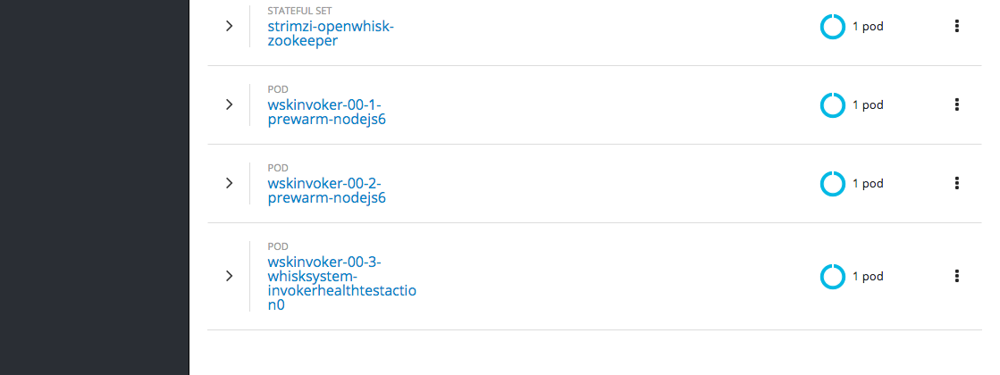

= Java Function as a Service(FaaS) Tutorial
Java Function as a Service(FaaS) Tutorial;
:revnumber: 1.0
:revdate: 17/03/2018
:toc: macro
:toclevels: 3
:toc-title: Java Function as a Service(FaaS) Tutorial
:doctype: book
:icons: font

ifndef::ebook-format[:leveloffset: 1]

(C) 2018 Red Hat Developer Experience Team.

ifdef::basebackend-html[toc::[]]

= Overview

This tutorial walks your through on how to build a Java functions on a Function as a Service(FaaS) platform
 https://openwhisk.apache.org/[Apache OpenWhisk].

== Prerequisites

You will need in this tutorial

=== Tools
* https://github.com/minishift/minishift/releases[minishift]
* https://www.docker.com/docker-mac[docker]
* https://kubernetes.io/docs/tasks/tools/install-kubectl/#install-kubectl-binary-via-curl[kubectl]
* oc (eval $(minishift oc-env))
* https://maven.apache.org[Apache Maven]
* stern (brew install stern)
* https://github.com/apache/incubator-openwhisk-cli/releases/[OpenWhisk CLI]
* curl, gunzip, tar are built-in to MacOS or part of your bash shell
* git (everybody needs the git CLI)

=== Setup minishift
Assumes minishift, tested with minishift v1.13.1+75352e5

Minishift creation script

[source,sh]
----

#!/bin/bash

# add the location of minishift executable to PATH

export MINISHIFT_HOME=~/minishift_1.13.1
export PATH=$MINISHIFT_HOME:$PATH

minishift profile set faas-tutorial
minishift config set memory 8GB
minishift config set cpus 3
minishift config set image-caching true
minishift addon enable admin-user
minishift addon enable anyuid #<1>

minishift start

minishift ssh -- sudo ip link set docker0 promisc on #<2>
----

<1> Some images that are in Apache OpenWhisk Docker hub requires anyuid SCC in OpenShift
<2> This is needed for pods to communicate with each other within the cluster (need to add more clear details here)

[IMPORTANT]
====
`minishift ssh -- sudo ip link set docker0 promisc on` command needs to be execute each and every time minishift restarted
====

=== Setup environment

[source,sh]
----
#!/bin/bash

eval $(minishift oc-env) && eval $(minishift docker-env)
oc login $(minishift ip):8443 -u admin -p admin
----

=== Setup OpenWhisk

The project https://github.com/projectodd/openwhisk-openshift[OpenWhisk on OpenShift] provides the OpenShift templates required to deploy Apache OpenWhisk.

[source,sh]
----
oc new-project faas #<1>
oc project -q #<2>
oc process -f https://git.io/openwhisk-template | oc create -f - #<3>
oc adm policy add-role-to-user admin developer -n faas #<4>
----

<1> Its always better to group certain class of applications, create a new OpenShift project called `faas` to deploy all OpenWhisk applications
<2> Make sure we are in right project
<3> Deploy OpenWhisk applications to `openwhisk` project
<4> (**Optional**) Add `developer` user as admin to `faas` project so as to allow you to login with developer user and access `faas` project

[NOTE]
====
You need to wait for sometime to have all the required OpenWhisk pods come up and the FaaS is ready for some load.  
You can watch the status via  `oc logs -f controller-0 -n faas | grep "invoker status changed`
====

==== Verify Deployment

Launch OpenShift console via `minishift console`, a successful deployment will look like:

image::OW_Deployed_Success_1.png[OpenWhisk Pods]
 

[[configure-wsk]]
==== Configure WSK CLI

Download https://github.com/apache/incubator-openwhisk-cli/releases/[OpenWhisk CLI] and add it your PATH.  Verify your path using the command
`wsk --help`

The https://github.com/apache/incubator-openwhisk-cli/releases/[OpenWhisk CLI] needs to be configured to know where the OpenWhisk is located
and the authorization that could be used to invoke `wsk` commands.  Run the following command to have that setup:

[code,bash]
----
#!/bin/bash

AUTH_SECRET=$(oc get secret whisk.auth -o yaml | grep "system:" | awk '{print $2}' | base64 --decode)
wsk property set --auth $AUTH_SECRET --apihost $(oc get route/openwhisk --template="{{.spec.host}}")
----

Successful setup of WSK CLI will show output like:

image::OW_wsk_cli_setup.png[WSK CLI] 

In this case the OpenWhisk API Host is pointing to the local minishift nip.io address

To verify if wsk CLI is configured properly run `wsk -i action list`,that should list some  actions which are installed as part of the 
OpenWhisk setup.  If you see empty result then you <<install-catalog>>

[TIP]
====
The `nginx` in OpenWhisk deployment uses a self-signed certificate, to avoid certificate errors when using `wsk`, you need to add `wsk -i` to each of
your `wsk` commands. For convinience you can add an alias to your profile like `alias wsk='wsk -i $@'`
==== 

[[install-catalog]]
==== Reinstall default Catalog 

If you are on a low bandwidth sometimes the default catalog will not be populated, run the following commands to have them installed
[code,sh]
----
#!/bin/bash

oc delete job install-catalog <1>

cat <<EOF | oc apply -f -
apiVersion: batch/v1
kind: Job
metadata:
  name: install-catalog
spec:
  activeDeadlineSeconds: 600
  template:
    metadata:
      name: install-catalog
    spec:
      containers:
      - name: catalog
        image: projectodd/whisk_catalog:openshift-latest
        env:
          - name: "WHISK_CLI_VERSION"
            valueFrom:
              configMapKeyRef:
                name: whisk.config
                key: whisk_cli_version_tag
          - name: "WHISK_AUTH"
            valueFrom:
              secretKeyRef:
                name: whisk.auth
                key: system
          - name: "WHISK_API_HOST_NAME"
            value: "http://controller:8080"
      initContainers:
      - name: wait-for-controller
        image: busybox
        command: ['sh', '-c', 'until wget -T 5 --spider http://controller:8080/ping; do echo waiting for controller; sleep 2; done;']
      restartPolicy: Never
EOF # <2>
----

<1> Delete the old job
<2> Run the install-catalog job again 

Now when you run `wsk -i action list` you should see output like:

image::OW_Install_Catalog.png[Install Catalog] 

== References

* https://github.com/apache/incubator-openwhisk/blob/master/docs/cli.md[Setup OpenWhisk CLI]